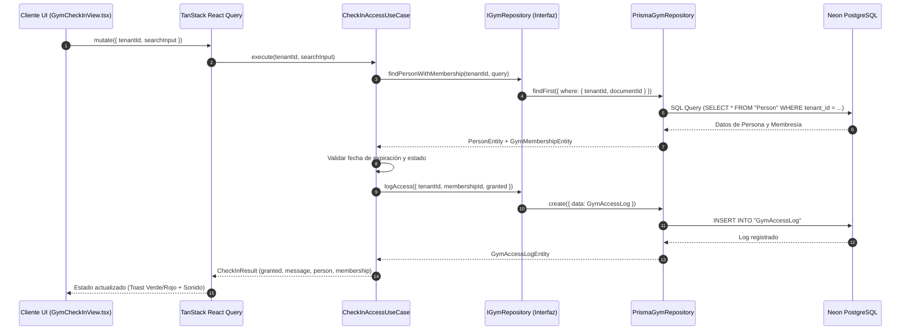

# 🏗️ ARCHITECTURE.md — ESPECIFICACIÓN DE ARQUITECTURA DE SOFTWARE

> **Generic System (SaaS Multi-Tenant & Multi-Industry Engine)**  
> Este documento detalla la arquitectura de software, patrones de diseño, estructura de capas y el flujo de datos utilizado en el proyecto.

---

## 📐 1. VISIÓN GENERAL DE ARQUITECTURA

**Generic System** está diseñado como un **Monolito Modular Extensible** basado en los principios de **Clean Architecture**, **Hexagonal Architecture (Ports & Adapters)** y **Domain-Driven Design (DDD)**.

```mermaid
graph TD
    subgraph UI Layer ["Capa de Presentación (Next.js 16 + React 19)"]
        UI["Páginas / Dashboard (src/app)"]
        COMP["Componentes (src/components)"]
        VUI["Vistas Modulares (src/modules/*/components)"]
    end

    subgraph State Layer ["Capa de Estado y Data Fetching"]
        TQ["TanStack React Query v5"]
        JT["Jotai (Estado Global UI)"]
    end

    subgraph Application Layer ["Capa de Aplicación / Casos de Uso"]
        UC_CORE["Casos de Uso Core (src/core/use-cases)"]
        UC_MOD["Casos de Uso Verticales (src/modules/*/use-cases)"]
    end

    subgraph Domain Layer ["Capa de Dominio (Pura & Agnóstica)"]
        ENT["Entidades Core (Person, Item, Tenant)"]
        PORTS["Puertos / Repositorios (IGymRepository, etc.)"]
    end

    subgraph Infrastructure Layer ["Capa de Infraestructura"]
        PRISMA["Prisma ORM (5.22.0)"]
        MOCK["Mock Repositories (Testing/Dev)"]
        DB[(PostgreSQL Neon Serverless)]
    end

    UI --> TQ
    VUI --> TQ
    TQ --> UC_MOD
    TQ --> UC_CORE
    UC_MOD --> PORTS
    UC_CORE --> PORTS
    PORTS <|.. PRISMA
    PORTS <|.. MOCK
    PRISMA --> DB
```

---

## 🧩 2. PATRONES DE DISEÑO CLAVE

### 1. Ports & Adapters (Arquitectura Hexagonal)
- **Puertos (`src/core/ports/`)**: Interfaces de TypeScript que definen lo que el dominio necesita del mundo exterior (ej. `IGymRepository`).
- **Adaptadores (`src/infrastructure/db/repositories/`)**: Implementaciones concretas de esos puertos utilizando Prisma ORM (`PrismaGymRepository`) o Mocks (`MockGymRepository`).
- **Beneficio**: Permite desacoplar totalmente la lógica de negocio de la base de datos o frameworks.

### 2. Multi-Tenancy Discriminado + Polimorfismo JSONB
- **Discriminador Único**: Todas las tablas principales poseen un campo `tenantId` indexado.
- **Campos Polimórficos (`JSONB`)**:
  - `Person.metadata`: Guarda datos específicos del tipo de cliente (ej. en GYM: fecha de nacimiento, foto, huella; en Farmacia: historial médico).
  - `Item.attributes`: Guarda datos del producto/servicio (ej. en GYM: días de duración, zonas de acceso; en Restaurante: ingredientes, alergias).
  - `Tenant.settings`: Guarda temas visuales, logo y banderas de características (feature flags).

### 3. Modular Monolith / Plugin Pattern
- Las verticales de negocio (ej. `gym`, `distribution`, `restaurant`) viven en `src/modules/<vertical>/`.
- Cada vertical contiene sus propios Casos de Uso, Entidades secundarias y Componentes de UI.
- Si un Tenant no tiene activo el módulo `gym`, esas rutas y vistas se ocultan dinámicamente mediante el sistema de permisos.

---

## 🏢 3. SEPARACIÓN DE CAPAS Y RESPONSABILIDADES

### 🟢 A. Capa de Dominio (`src/core/entities/` & `src/core/ports/`)
- Contiene las definiciones esenciales del negocio en TypeScript puro.
- **Regla Estricta**: No importa librerías de UI (React, Next.js) ni ORMs (Prisma).

### 🔵 B. Capa de Aplicación (`src/core/use-cases/` & `src/modules/*/use-cases/`)
- Contiene los **Casos de Uso** (ej. `CheckInAccessUseCase`).
- Recibe los puertos mediante **Inyección de Dependencias** (en el constructor) y ejecuta las reglas de negocio (ej. verificar si una membresía está vencida y registrar el intento de acceso).

### 🟡 C. Capa de Infraestructura (`src/infrastructure/`)
- **Prisma Client**: `src/infrastructure/db/prisma.ts`.
- **Repositorios Concretos**: `PrismaGymRepository` ejecuta las consultas SQL/Prisma incluyendo siempre `tenantId`.

### 🔴 D. Capa de Presentación (`src/app/`, `src/components/`)
- **App Router (`src/app/[locale]/`)**: Manejo de internacionalización (`next-intl`) y enrutamiento.
- **React Query Hooks**: Consumen los casos de uso para manejar estados de carga (`isLoading`), error (`isError`) y caché.
- **Jotai**: Estado atómico global para la interfaz (ej. tenant activo, sidebar colapsada).
- **Shadcn UI + Tailwind CSS v4**: Componentes accesibles y estilizados.

---

## 🔄 4. FLUJO DE DATOS END-TO-END (EJEMPLO: ACCESO / CHECK-IN EN GYM)



---

## 🗄️ 5. ARQUITECTURA DE BASE DE DATOS (PRISMA SCHEMA)

El esquema de datos central en `prisma/schema.prisma` se divide en bloques (ver `DATABASE.md` para contexto operativo):

1. **Entidades Core (Universales para todos los Tenants)**:
   - `Tenant`: Cliente SaaS (ej: "Distribuidora San José").
   - `Branch`: Sucursal física por Tenant → `tenantId` en toda consulta.
   - `User`: Usuarios del sistema con roles (`SUPER_ADMIN`, `TENANT_ADMIN`, `STAFF`, `CUSTOMER`).
   - `Person`: Entidad polimórfica para clientes y empleados (`metadata JSONB`).
   - `Item` / `Inventory`: Productos o servicios polimórficos (`attributes JSONB`) + stock por sucursal. **SKU único por Tenant** (`@@unique([tenantId, sku])`).
   - `Sale` / `SaleItem`: Transacciones y facturación POS. **Factura única por Tenant** (`@@unique([tenantId, invoiceNumber])`).
   - `SaleCounter`: Correlativo secuencial de facturas (incrementado en la misma transacción de la venta).

2. **Entidades Verticales (Específicas de un Rubro)**:
   - **Gym**: `GymMembership`, `GymAccessLog`.
   - **Distribution**: `Supplier`, `PurchaseOrder`, `Employee`, `CashSession`, `CashMovement`, `TaxRate` (modelo fiscal IVA con `isDefault` único por Tenant y `isInclusive`).

## 🔐 6. AUTENTICACIÓN Y SESIONES

Sesión propia con JWT firmado HS256 (`jose`) en cookie `httpOnly` `gs_session` (7 días). Passwords y PIN POS hasheados con `bcryptjs` (nunca en texto plano).

- **Flujo**: `POST /api/auth/login` (modes `admin`: email+password, `pos`: PIN) → firma payload `{ userId, tenantId, role, name, email }` y setea la cookie. `POST /api/auth/logout` la destruye. `GET /api/auth/me` expone el usuario actual.
- **Middleware** (`middleware.ts`): compone `next-intl` + guard de sesión. Páginas públicas: raíz por locale y `/login`. Todo lo demás exige token válido → redirect a `/login`. Matcher excluye `api|_next|static`.
- **Tenancy server-side (anti-spoofing)**: las rutas `/api/distribution/*` derivan `tenantId` de la sesión (`requireTenantId`/`requireApiAuth` en `src/lib/session.ts`) y responden `401` sin sesión. El cliente **NUNCA** envía `tenantId` en query ni body.
- **Librerías**: `src/lib/session-token.ts` (edge-safe: firmar/verificar), `src/lib/session.ts` (`server-only`), `src/lib/security.ts` (bcrypt).
- **Entorno**: `AUTH_SECRET` en `.env` (server exclusivamente; no exponer).

## 🚚 7. VERTICAL DE REFERENCIA: MÓDULO DISTRIBUCIÓN

Implementado de extremo a extremo como patrón para las demás verticales (dominio → puerto → adaptador → API → React Query → UI):

### Flujo de venta (POS)
1. `SalesPOSView` consulta inventario y clientes (React Query); el carrito aplica descuento y cliente opcional. La sesión (con `tenantId`) viaja solo en la cookie; cada ruta lo deriva en el servidor.
2. `POST /api/distribution/sales` → `registerSale`:
   - Exige **sesión de caja abierta**.
   - Usa la **tasa default activa** del catálogo (IVA incluido: `taxAmount = base × tasa/(100+tasa)`).
   - Descuenta stock en una `$transaction` con guard `stock >= qty` (409 si no alcanza).
   - Genera correlativo `INV-YYYYMMDD-NNNNNN` vía `SaleCounter`, único por Tenant.
3. Éxito: invalidación de consultas (inventario, caja, dashboard, resumen fiscal, historial).

### Otras vistas conectadas
- **Dashboard General**: ventas hoy/mes, top productos, abre/cierra caja.
- **Inventario**: CRUD con verificador de SKU único.
- **Control de Caja**: apertura, movimientos IN/OUT, cierre con diferencia.
- **Proveedores & Compras** / **Empleados&Comisiones**: CRUD + órdenes de compra.
- **Impuestos & Facturación CAI**: catálogo editable de tasas (agregar/editar/eliminar/predeterminar) + resumen fiscal del mes (ventas, IVA recaudado, utilidad bruta).
- **Historial de Ventas**: facturas con detalle, búsqueda por cliente/factura.

### Convenciones aplicadas
- Vistas consumen `/api/distribution/*` con helpers tipados (`apiGet`/`apiSend` en `src/modules/distribution/api.ts`).
- `tenantId` en **toda** query/repo (aislamiento estricto), derivado server-side de la sesión.
- API de errores en español con códigos correctos (400/401/404/409).
