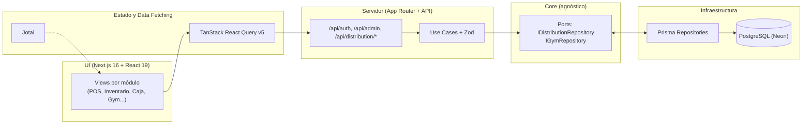

# 🤖 Generic System

Motor **SaaS Multi-Tenant de marca blanca** (Monolito Modular Extensible) para múltiples industrias: Distribución, Gimnasios, Retail, etc. Un solo código base desplegado atiende a muchos clientes (Tenants); las funcionalidades específicas de cada rubro viven como módulos verticales activables (`src/modules/<vertical>`).

## 📌 ¿Qué es y cómo funciona?

- **Núcleo genérico unificado (Core Engine)**: una única base de código para todos los clientes — **cero forks por rubro**.
- **Multi-tenancy estricto**: toda consulta lleva `tenantId` derivado **server-side** de la sesión (anti-spoofing); el cliente nunca lo envía.
- **Modelo polimórfico**: `Person.metadata`, `Item.attributes` y `Tenant.settings` son `JSONB` — atributos de rubro sin cambiar el esquema SQL.
- **Verticales activables por Tenant**: la vertical **Distribution** está completa E2E (POS, inventario con kardex, caja, compras, impuestos/CAI, CxC, devoluciones); la vertical **Gym** está en desarrollo (check-in sobre mock).
- **Arquitectura en capas**: Clean Architecture + Ports & Adapters; el dominio (`src/core/`) es agnóstico a BD y UI.



## 🧩 Verticales implementadas

| Vertical | Estado | Qué incluye |
| :--- | :--- | :--- |
| **Distribución** | ✅ E2E | POS con IVA inclusivo y correlativo de facturas, inventario con kardex (ajustes, conteo físico), control de caja, proveedores y órdenes de compra, empleados con PIN POS, clientes, tasas de impuesto y CAI, resumen fiscal, devoluciones, cuentas por cobrar, cierre diario, dashboard |
| **Gimnasio** | ⚠️ Parcial | `CheckInAccessUseCase` + vista de check-in (verde/rojo) sobre `MockGymRepository`; sin API `/api/gym/*` ni persistencia real (hoja de ruta en `PLAN.md` Fase 1) |

## Stack

| Capa | Tecnología |
| :--- | :--- |
| Framework Web | Next.js 16 (App Router, i18n) |
| UI | React 19 + Tailwind CSS v4 + Shadcn UI / Radix |
| Iconos | lucide-react |
| Base de datos | PostgreSQL (Neon Serverless) |
| ORM | Prisma 5.22 |
| Data Fetching & Cache | TanStack React Query v5 |
| Estado global UI | Jotai |
| Validación | Zod / TypeScript |
| Tests | Vitest |

## Requisitos

- Node.js 20+ (el proyecto se desarrolló con Node 25).
- Cuenta en Neon (PostgreSQL serverless) con dos URLs en `.env`:

```bash
DATABASE_URL=postgresql://...   # Pooler (entorno de ejecución)
DIRECT_URL=postgresql://...     # Sin pooler (scripts, seed)
```

`.env*` está ignorado por git: **no se commitean credenciales**.

## Primeros pasos

```bash
npm install
npm run db:seed   # Crea tenant demo "distribuidora-sanjose" + datos
npm run dev       # http://localhost:3000
```

> El seed es **destructivo**: borra y recrea los datos del tenant demo. El `id` del tenant es aleatorio por corrida; se resuelve por `slug`.

## Scripts

| Script | Descripción |
| :--- | :--- |
| `npm run dev` | Servidor de desarrollo (Next.js) |
| `npm run build` | Build de producción |
| `npm run start` | Servidor de producción |
| `npm run lint` | ESLint |
| `npm run db:seed` | Seed demo (destructivo) |

## Estructura

```text
src/
├── app/                     # App Router (rutas i18n [locale] y API /api/)
│   └── api/                 # auth, admin/tenants, distribution/*
├── core/                    # Núcleo agnóstico (Clean Architecture)
│   ├── entities/            # Modelos puros de TypeScript (*Entity)
│   ├── ports/               # Contratos (IDistributionRepository, IGymRepository)
│   └── schemas/             # Zod (validación de inputs)
├── infrastructure/          # Adaptadores Prisma/BD
│   └── db/repositories/     # PrismaXRepository, MockXRepository
├── modules/<vertical>/      # Lógica, use cases y UI por rubro (distribution, gym)
├── features/                # Auth (login admin/POS), Admin de tenants, Dashboard
├── components/              # Sistema de diseño UI (Shadcn)
├── lib/                     # Sesión multi-tenant (JWT), seguridad, utilidades
└── hooks/                   # React Query, Jotai
```

## 📚 Documentación

| Documento | Contenido |
| :--- | :--- |
| `README.md` | Esta guía rápida |
| `ARCHITECTURE.md` | Arquitectura, capas, patrones y flujo de datos |
| `docs/UML_DIAGRAMS.md` | Diagramas UML: componentes, clases, secuencia y estados |
| `docs/DATA_MODEL.md` | Modelo de datos con diagramas ER y reglas de integridad |
| `docs/USE_CASES.md` | Actores, casos de uso (diagramas + especificaciones) |
| `DATABASE.md` | Contexto operativo de la BD (conexión, migraciones, seed) |
| `PROJECT_VISION.md` | Visión del producto y hoja de ruta |
| `PLAN.md` | Camino al 100%: estado verificado y fases de cierre |
| `AGENTS.md` | Reglas de desarrollo y convenciones para IA y humanos |

**Lectura sugerida para nuevos integrantes**: `README.md` → `PROJECT_VISION.md` → `ARCHITECTURE.md` → `docs/DATA_MODEL.md` → `docs/USE_CASES.md` → `docs/UML_DIAGRAMS.md`.

## Convención de commits

Commits en formato [Conventional Commits](https://www.conventionalcommits.org/) con husky + commitlint:
`feat(...)`, `fix(...)`, `refactor(...)`, `docs(...)`, `test(...)`, `chore(...)`.