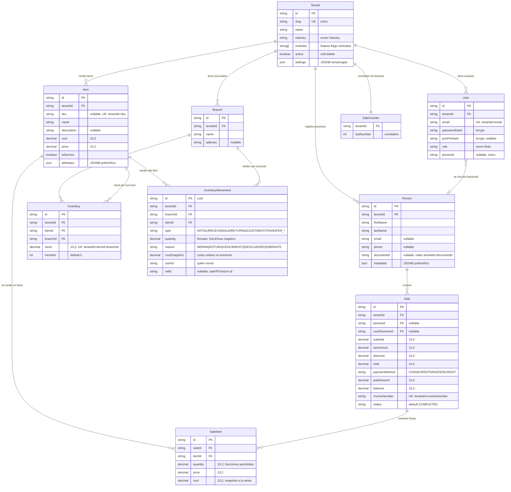
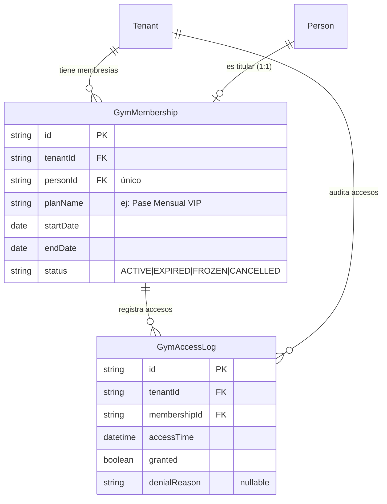
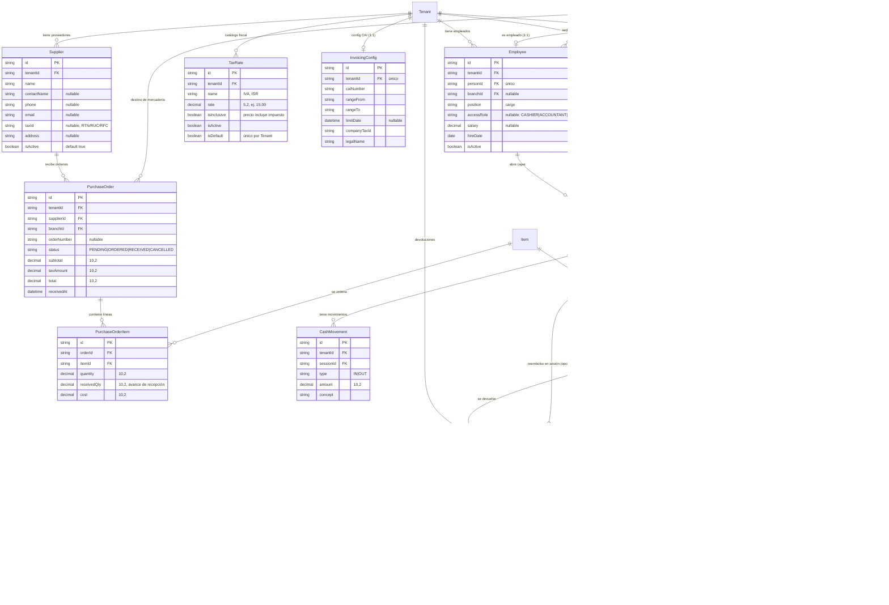

# 🗄️ DATA_MODEL.md — MODELO DE DATOS Y DIAGRAMA ENTIDAD-RELACIÓN

> **Generic System** — SaaS Multi-Tenant.
> Esquema real en `prisma/schema.prisma`. Este documento lo traduce a **diagramas ER (Mermaid)** y explica cada dominio, las reglas de integridad y el polimorfismo JSONB. Para operación (conexión, migraciones, seed) ver `DATABASE.md`.

---

## 1. VISIÓN GENERAL

| Bloque | Modelos | Propósito |
| :--- | :--- | :--- |
| **Core** | `Tenant`, `Branch`, `User`, `Person`, `Item`, `Inventory`, `InventoryMovement`, `Sale`, `SaleItem`, `SaleCounter` | Universales para todo tenant: identidad, personas, catálogo, stock, ventas |
| **Vertical Gym** | `GymMembership`, `GymAccessLog` | Membresías y control de accesos |
| **Vertical Distribution** | `Supplier`, `PurchaseOrder`, `PurchaseOrderItem`, `Employee`, `CashSession`, `CashMovement`, `TaxRate`, `InvoicingConfig`, `Receivable`, `ReceivablePayment`, `SaleReturn`, `SaleReturnItem` | Compras, caja, empleados, impuestos/CAI, cuentas por cobrar, devoluciones |

**Regla de oro**: toda tabla vertical/core de negocio lleva `tenantId` con FK `ON DELETE CASCADE` e índice — **cero leaks entre tenants** (ver `AGENTS.md` Rule #1).

---

## 2. DIAGRAMA ER — NÚCLEO (CORE)



> **Kardex**: `InventoryMovement` es el libro contable del stock. Toda variación de `Inventory.stock` escribe una fila **en la misma transacción**. Convención de signo: `SALE` y pérdidas negativos; `RECEIVE`, `RETURN` y `SOBRANTE` positivos; `INITIAL` firmado como se dio. `TRANSFER_OUT/TRANSFER_IN` están reservados para la Fase 3 (no se escriben aún).

---

## 3. DIAGRAMA ER — VERTICAL GIMNASIO



---

## 4. DIAGRAMA ER — VERTICAL DISTRIBUCIÓN



---

## 5. POLIMORFISMO JSONB (CLAVE DEL DISEÑO)

Las entidades centrales usan campos `JSON` (PostgreSQL **JSONB**) para atributos específicos de rubro **sin alterar el esquema SQL**:

```
┌─────────────┐   ┌───────────────┐   ┌──────────────────┐
│  Person     │   │  Item         │   │  Tenant          │
│  metadata   │   │  attributes   │   │  settings        │
├─────────────┤   ├───────────────┤   ├──────────────────┤
│ Gimnasio:   │   │ Gimnasio:     │   │ logoUrl          │
│ fecha_nac  │   │ durationDays  │   │ primaryColor     │
│ foto       │   │ accessZone    │   │ currency         │
│ huella_id  │   │ Restaurante:  │   │ timezone         │
│ Farmacia:  │   │ ingredientes  │   │ feature flags    │
│ historial  │   │ alergias      │   └──────────────────┘
│ médico     │   └───────────────┘
└─────────────┘
```

- Tipado estricto: cada vertical valida su JSONB con **esquemas Zod** específicos (`src/core/schemas/`), nunca `any`.
- `Item.isService` distingue productos de servicios (ej. una membresía es un `Item` con `isService = true`).

---

## 6. REGLAS DE INTEGRIDAD DESTACADAS

| Regla | Mecanismo |
| :--- | :--- |
| **Aislamiento estricto** | `tenantId` en toda consulta; FKs con `ON DELETE CASCADE`; índices por tenant |
| **SKU único por tenant** | `@@unique([tenantId, sku])` → `409` si se repite |
| **Factura única por tenant** | `@@unique([tenantId, invoiceNumber])` |
| **Correlativo atómico** | `SaleCounter` se incrementa en la misma transacción de la venta |
| **Stock nunca negativo** | Guard `stock >= qty` en transacciones + rechazo de ajustes negativos que dejen stock < 0 (`409`) |
| **Kardex integro** | Cada variación de stock = una fila `InventoryMovement` en la misma transacción, con `costSnapshot` |
| **IVA default único** | El repositorio limpia los demás `isDefault` al marcar una tasa |
| **Devolución sin sobrepasar** | Devuelto acumulado ≤ vendido → `409`; reembolso > saldo de CxC → `409` |
| **Cobro sin sobrepago** | Pago ≤ saldo restante → `409` |
| **Persona 1:1 con rol** | `User.personId` único; `GymMembership.personId` único; `Employee.personId` único |
| **Empleado desactivado = PIN revocado** | `posPinHash` se anula en la misma transacción del `isActive: false` |

---

## 7. ENUMS DE NEGOCIO

| Enum | Valores | Dónde |
| :--- | :--- | :--- |
| `Industry` | `GENERIC`, `GYM`, `RESTAURANT`, `PHARMACY`, `RETAIL`, `DISTRIBUTION` | `Tenant.industry` |
| `Role` | `SUPER_ADMIN`, `TENANT_ADMIN`, `STAFF`, `CUSTOMER`, `CASHIER`, `ACCOUNTANT` | `User.role` |
| `AccessRole` | `CASHIER`, `ACCOUNTANT`, `MANAGER` (nullable) | `Employee.accessRole` |
| `InventoryMovementType` | `INITIAL`, `RECEIVE`, `SALE`, `RETURN`, `ADJUSTMENT`, `TRANSFER_OUT`, `TRANSFER_IN` | `InventoryMovement.type` |
| `InventoryAdjustmentReason` | `MERMA`, `ROTURA`, `VENCIMIENTO`, `DESCUADRE`, `SOBRANTE` | `InventoryMovement.reason` |

> Los estados de flujo (`CashSession.status`, `PurchaseOrder.status`, `Receivable.status`, `GymMembership.status`) son `String` documentados por convención; ver diagramas de estados en `UML_DIAGRAMS.md` §5.