# 📐 UML_DIAGRAMS.md — DIAGRAMAS UML DEL SISTEMA

> **Generic System** — SaaS Multi-Tenant.
> Diagramas de **componentes, clases, secuencia y estados** generados con [Mermaid](https://mermaid.js.org/) (renderizan en GitHub/GitLab). Complementan a `ARCHITECTURE.md` (visión general y patrones) y a `DATA_MODEL.md` (entidad-relación).

---

## 1. DIAGRAMA DE COMPONENTES (ARQUITECTURA EN CAPAS)

```mermaid
graph TD
    subgraph Presentacion["Capa de Presentación (Cliente)"]
        LOGIN["/login<br/>(admin + POS PIN)"]
        DASH["Dashboard /[locale]<br/>Páginas por módulo"]
        VISTAS["Views Distribution<br/>SalesPOS, Inventory, Cash..."]
        GYM_UI["GymCheckInView"]
    end

    subgraph Estado["Estado UI"]
        RQ["TanStack React Query v5<br/>(cache + invalidación)"]
        JT["Jotai<br/>(estado global UI)"]
    end

    subgraph Aplicacion["Capa de Aplicación"]
        CASOS["Use Cases<br/>CheckInAccessUseCase"]
        RUTAS["API Routes /api<br/>(Next.js App Router)"]
        SCHEMAS["Zod schemas<br/>(validación de inputs)"]
    end

    subgraph Dominio["Capa de Dominio (agnóstica)"]
        ENT["Entities<br/>SaleEntity, PersonEntity..."]
        PORTS["Ports (interfaces)<br/>IDistributionRepository<br/>IGymRepository"]
    end

    subgraph Infra["Capa de Infraestructura"]
        REPO["Prisma Repositories<br/>PrismaDistributionRepository..."]
        MOCK["Mock Repositories<br/>MockGymRepository (gym: dev)"]
        PRISMA["Prisma Client<br/>src/infrastructure/db/prisma.ts"]
    end

    DB[("PostgreSQL<br/>Neon Serverless")]

    LOGIN --> RUTAS
    DASH --> RQ
    VISTAS --> RQ
    GYM_UI --> CASOS
    RQ --> RUTAS
    CASOS --> PORTS
    RUTAS --> SCHEMAS
    RUTAS --> PORTS
    PORTS <|.. REPO
    PORTS <|.. MOCK
    REPO --> PRISMA
    MOCK -.-> CASOS
    PRISMA --> DB
```

> **Flujo típico**: `View → React Query → API Route (Zod) → Port → PrismaRepository → PostgreSQL`. El cliente **nunca** envía `tenantId`; el servidor lo deriva de la sesión (`requireTenantId`).

---

## 2. DIAGRAMA DE CLASES — DOMINIO Y PUERTOS

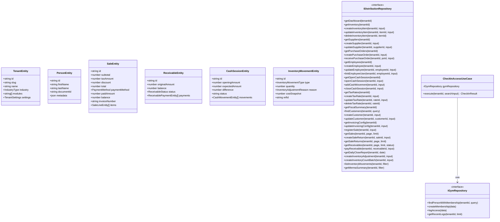

> **Regla arquitectónica**: el dominio (`src/core/`) no importa infraestructura ni UI. Los puertos son interfaces puras de TypeScript (`I` prefijo); las entidades usan el sufijo `Entity`.

---

## 3. DIAGRAMA DE CLASES — ADAPTADORES Y ANATOMÍA DE VENTA

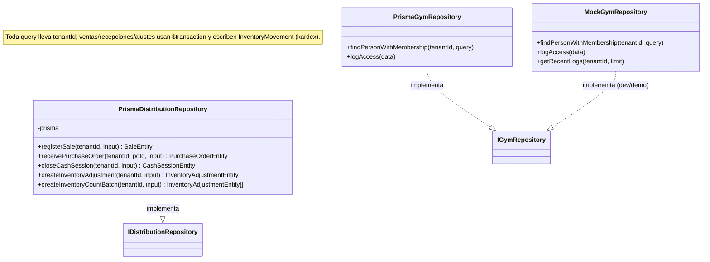

**Anatomía de una venta (`registerSale`)** — transacción atómica:

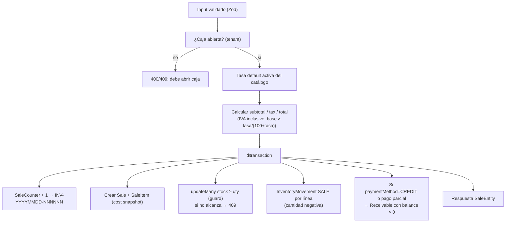

---

## 4. DIAGRAMAS DE SECUENCIA

### 4.1 Login administrador (POST /api/auth/login)

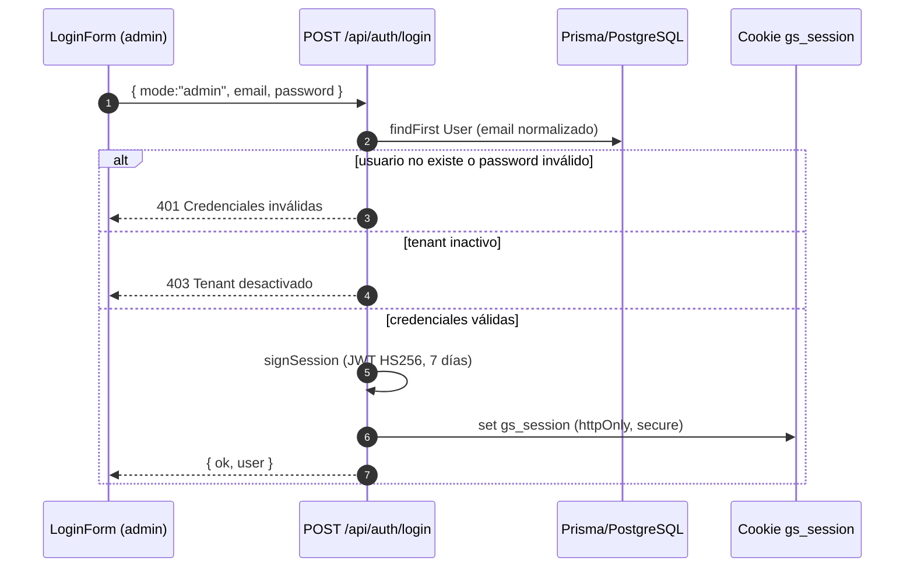

### 4.2 Login POS por PIN (POST /api/auth/pos-login, tenant-aislado)

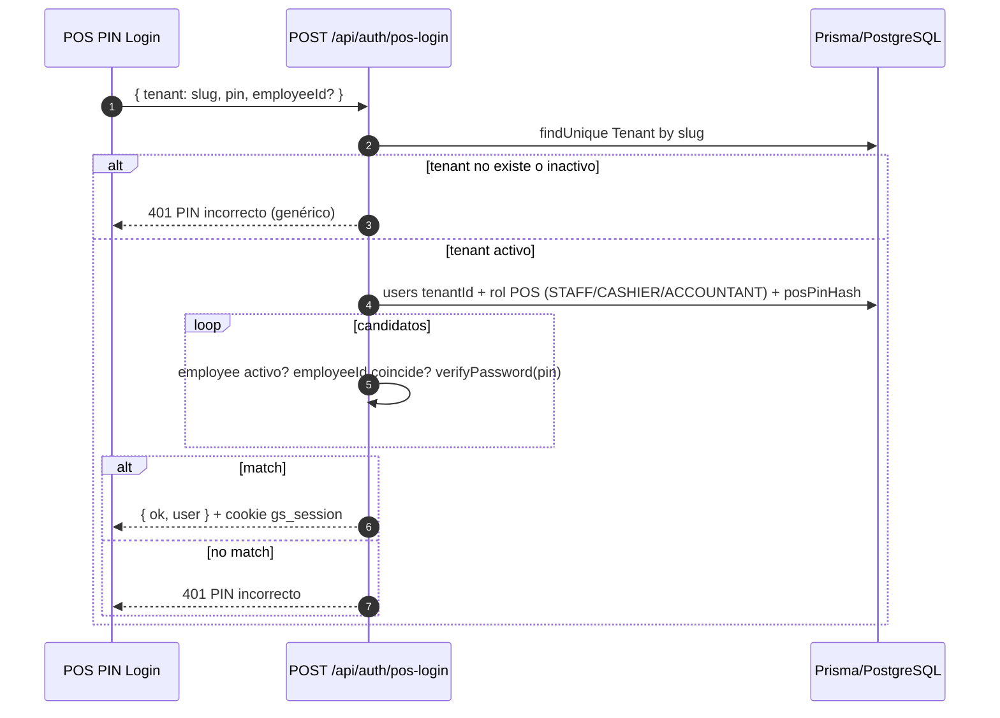

### 4.3 Venta POS (POST /api/distribution/sales)

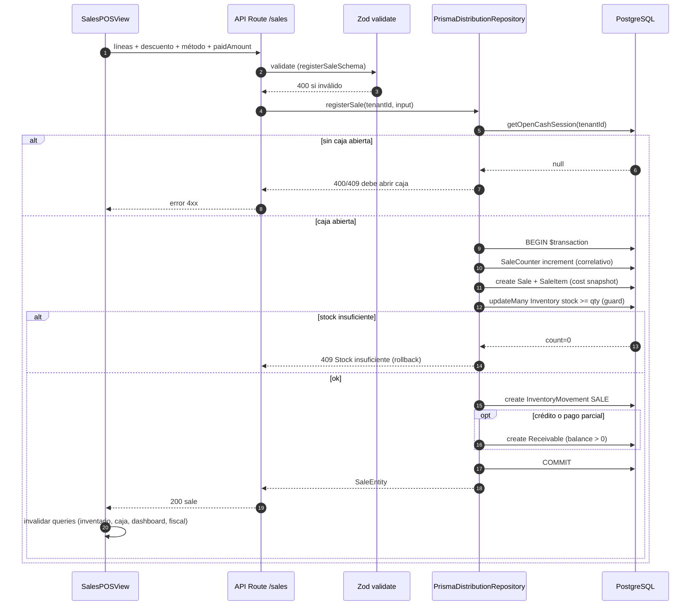

### 4.4 Cierre de caja (POST /api/distribution/cash/close)

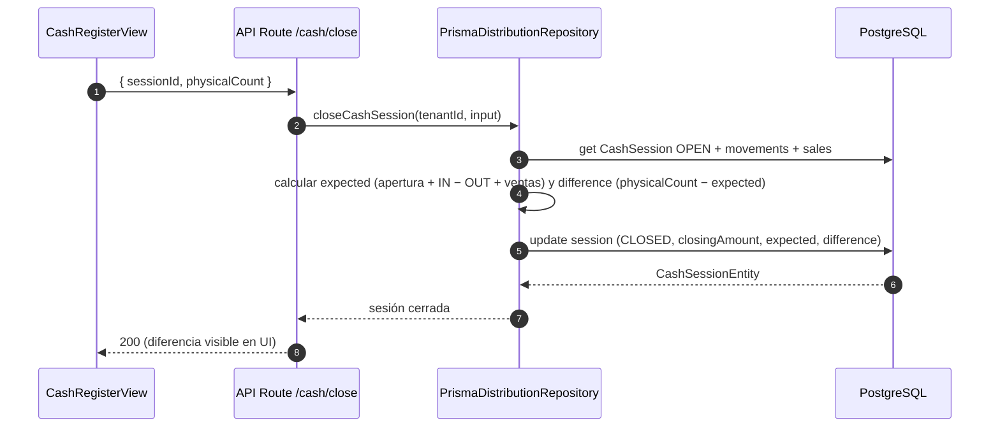

### 4.5 Check-in de socio (Gimnasio, hoy con mock)

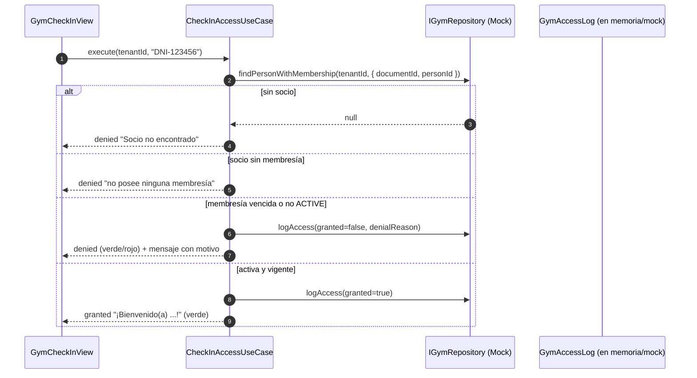

---

## 5. DIAGRAMAS DE ESTADOS

### 5.1 Sesión de caja (`CashSession`)

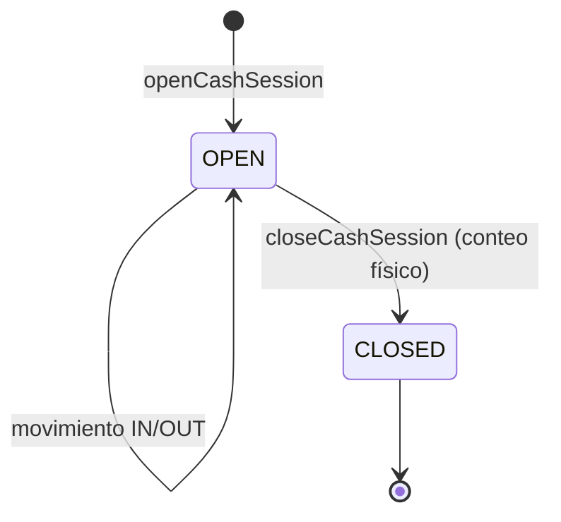

> Solo **una** caja `OPEN` por tenant; el cierre exige ventas registradas y movimientos; la diferencia se calcula server-side.

### 5.2 Orden de compra (`PurchaseOrder`)

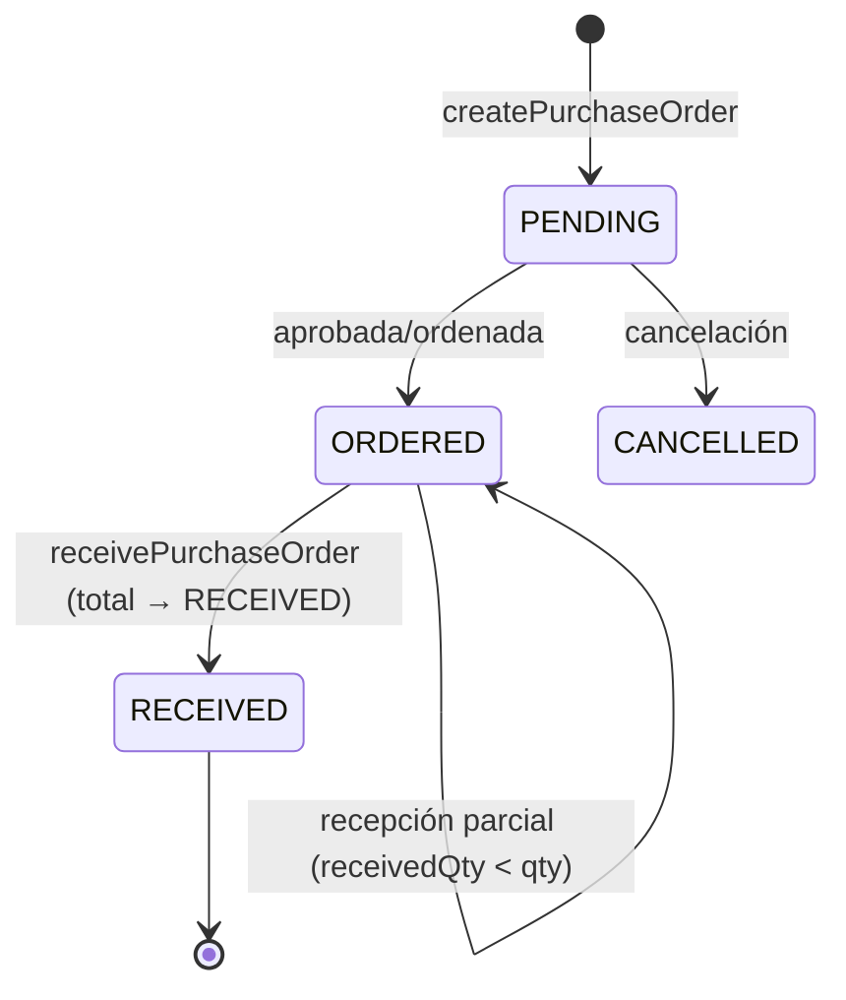

### 5.3 Cuenta por cobrar (`Receivable`)

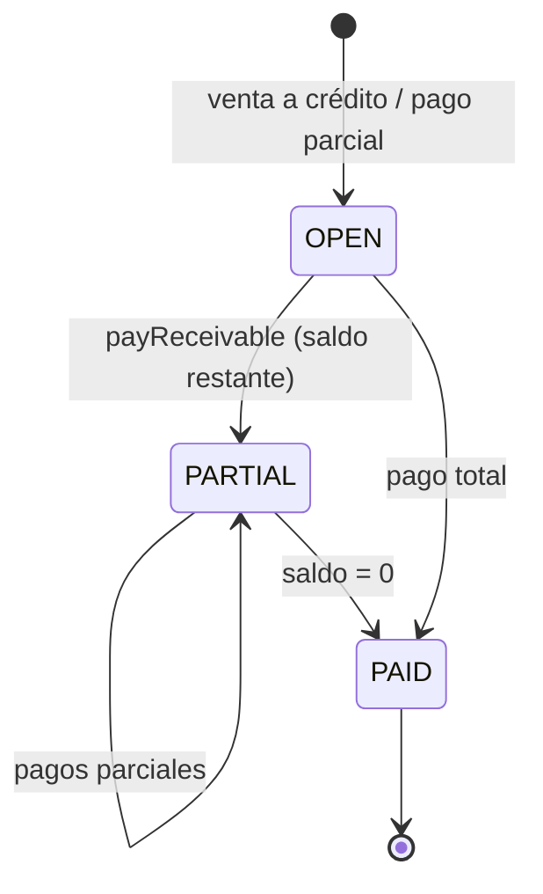

### 5.4 Membresía de gimnasio (`GymMembership`)

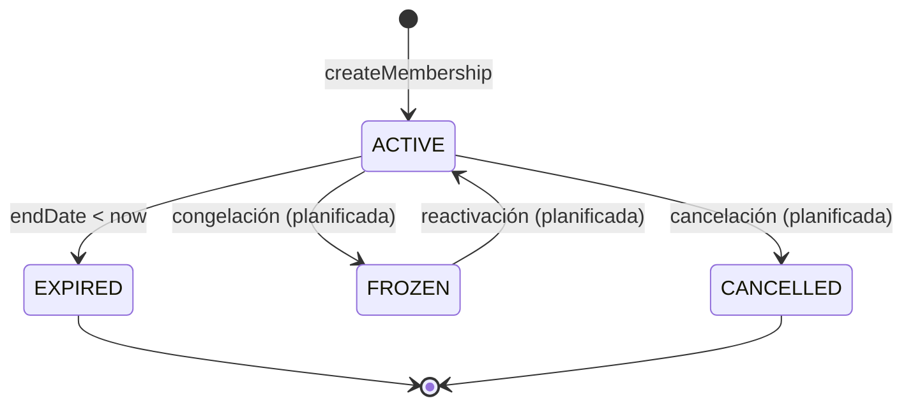

### 5.5 Venta (`Sale`)

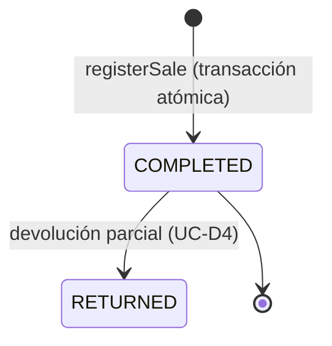

---

## 6. MAPA DE ESTRUCTURA (ARQUITECTURA DE CARPETAS)

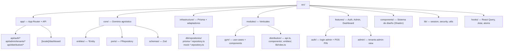

---

## 7. REFERENCIAS

- `ARCHITECTURE.md` — visión de arquitectura, patrones, flujo end-to-end gym.
- `DATA_MODEL.md` — diagramas ER y reglas de integridad.
- `USE_CASES.md` — casos de uso y especificaciones detalladas.
- `prisma/schema.prisma` — fuente de verdad del esquema.
- `src/core/ports/` — contratos exactos de los puertos.